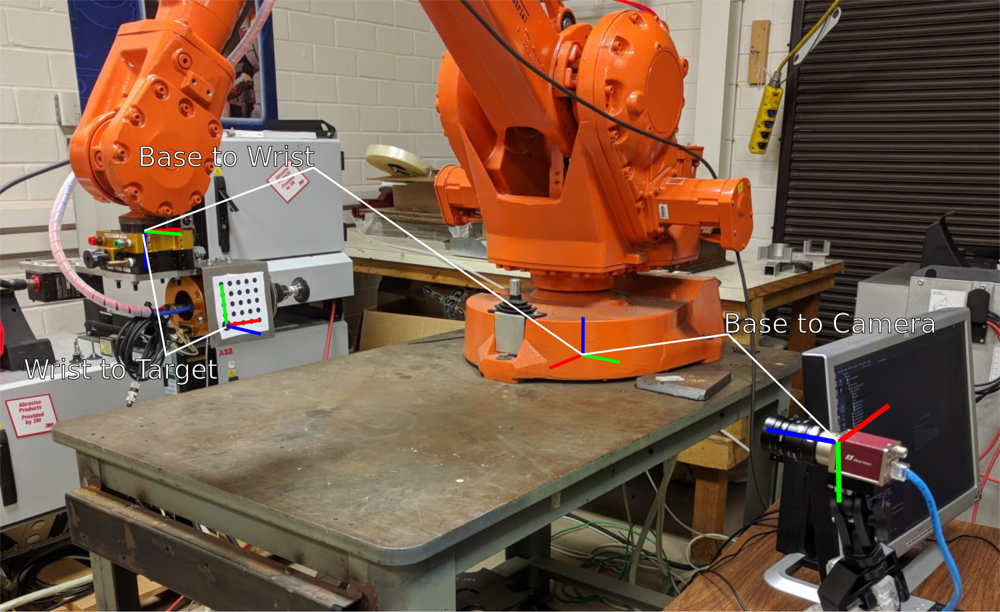

# Industrial Calibration

## Description
A set of tools for performing calibration between cameras and robots and analyzing the accuracy of the calibration.

See the [documentation](https://ros-industrial.github.io/industrial_calibration) for more information on the project.
