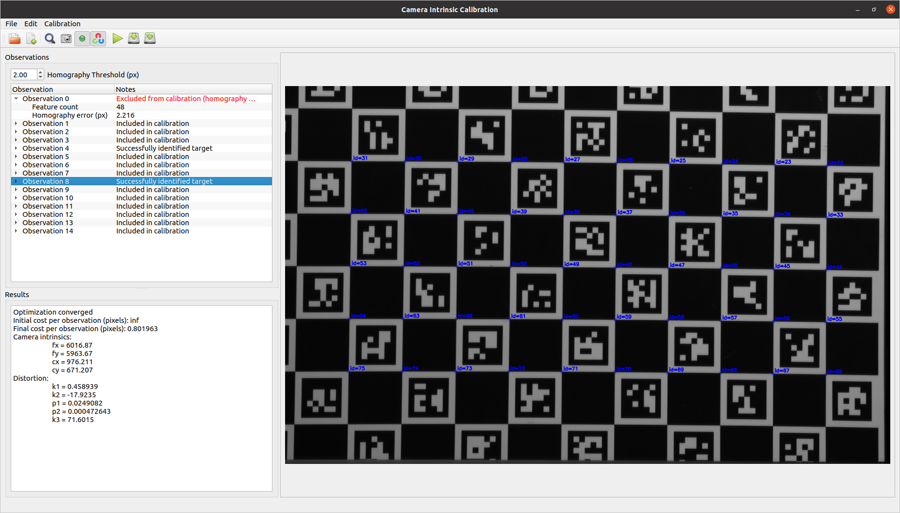

# Camera Intrinsic Calibration Application



This application performs camera intrinsic calibration based on 2D camera images and measured poses from the camera to the target.
The application requires a file that specifies the configuration of the calibration problem and the observation data to be used in the calibration.
The outputs of this calibration are:
  - the camera intrinsic parameters for a pinhole camera model
  - the distortion parameters for a pinhole camera model
  - the optimized estimates of each camera to target transform

## Observation Definition
The observation data for this application consists of:
  - Pose measurements from the camera frame to the target frame, saved to a YAML file
  - 2D image files in OpenCV-compatible formats (e.g., .png, .jpg, etc.)
  
The observation data and YAML file can be generated by the [calibration data collector node in `industrial_calibration_ros`](https://github.com/ros-industrial/industrial_calibration_ros/blob/49e34d6ee91e40ecc5631bb98d34578219006e8c/launch/data_collection.launch).
Alternatively, users can collect calibration data manually and generate the observation YAML file by hand.

Pose files should be specified as a position vector in meters and quaternion, in the following format:

```yaml
x:  0.0  # (m)
y:  0.0  # (m)
z:  0.0  # (m)
qx: 0.0
qy: 0.0
qz: 0.0
qw: 1.0
```

The observations should be collated into a YAML file (e.g., `cal_data.yaml`) that lists each corresponding pair of image and pose files.
The image and pose files should be specified by their local directory, relative to the location of this file.

```yaml
data:
  - image: <relative>/<path>/<to>/<image>
    pose:  <relative>/<path>/<to>/<pose>/<file>
  - image: ...
    pose:  ...
  - image: ...
    pose:  ...
```

## Configuration Definition
Additional configuration information about the system also needs to be provided in order to perform the calibration.
This configuration can be generated and saved to YAML file from the GUI using the icons and menu options.
The format of the YAML configuration file is as follows:

  - **`intrinsics_guess`**
      - Estimated camera intrinsic parameters for a pinhole model camera, without distortion
  - **`target_finder`**
      - Plugin configuration for target finder used to detect the calibration target in the image observations
      - Example configuration files can be found [here for a `ModifiedCircleGridTargetFinder`](../examples/data/test_set_10x10/cal_data.yaml) 
      and [here for a `CharucoGridTargetFinder`](../examples/data/test_set_charuco/cal_data.yaml).
  - **`homography_threshold`**
      - In general, we want to ensure that the calibration target features observed in an image matches closely to the known geometry of the target
      - For planar calibration targets and 2D images, we can do this by computing a homography transform between the known target features and the observed target features
      - This homography transform projects the known target features onto the observed target features, allowing us to measure the average distance between corresponding features (in pixels)
      - If the average homography error is above a specified threshold value, we want to exclude that observation from the calibration because the observed target match close enough to our known target geometry
  - **`use_extrinsic_guesses`**
      - If true, use the measured camera to target poses to seed the optimization. 
      It is **highly recommended** to use measured poses for the extrinsic guesses.
      - If false, an arbitrary static camera to target transform will be used to seed the optimization.
  - **`use_opencv`**
      - Flag indicating whether to use the OpenCV intrinsic calibration algorithm over the one provided in `industrial_calibration`

Here is an example of a calibration configuration YAML file:

```yaml
# Camera intrinsics
intrinsics_guess:
  fx: 1352.02747
  fy: 1356.14287
  cx: 789.67065
  cy: 627.2995

# Target finder
target_finder:
  type: <target finder plugin name>
  <target_finder_params>: ...

# Other parameters
homography_threshold: 2.0
use_extrinsic_guesses: true
use_opencv: false
```


